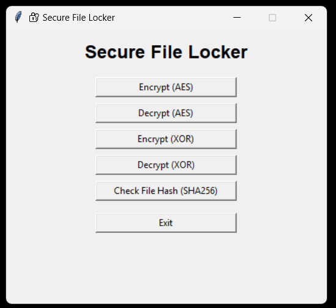
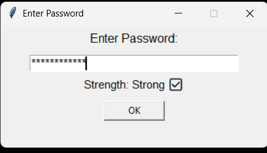
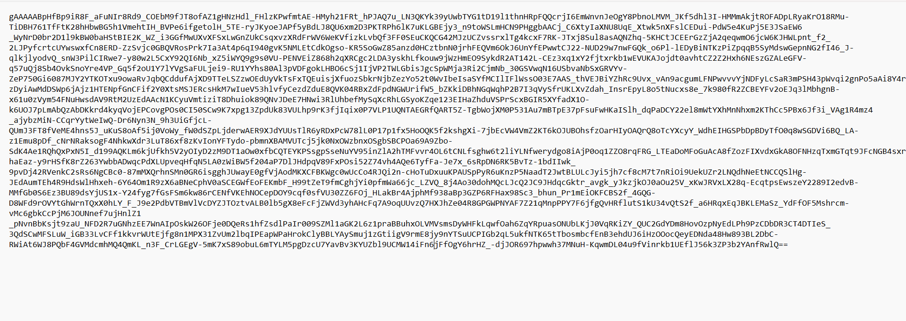

🔐 Secure File Locker – Mini Project
AES & XOR Encryption | SHA-256 Hashing | Password Strength | GUI-based File Security Tool

A simple but powerful file encryption and decryption tool built using Python.
Supports AES encryption, XOR encryption, password strength detection,
and file integrity checking (SHA-256) — all through a clean and minimal GUI.

🚀 Features
✅ AES Encryption & Decryption

* Industry-standard encryption
* Restores original file extension after decrypt
* Works with TXT, PDF, PNG, JPG, DOCX, ZIP, etc.

✅ XOR Encryption & Decryption

* Lightweight stream cipher
* Good for demo and understanding how XOR works

✅ Password Strength Meter (Live)

* Shows Weak / Medium / Strong
* Updates instantly while typing
* Prevents insecure passwords

✅ SHA-256 Hashing

* Quickly verify file integrity
* Useful for checking if a file was modified

✅ GUI Built With Tkinter

* Simple, clean and desktop-app style
* No complicated setup

✅ Auto Save / Auto Rename

* Automatically avoids overwriting existing files

📸 Screenshots

🖥️ Application GUI  

🔑 Password Strength Detection  

📄 Before Encryption (Original File)  

🔒 After AES Encryption  

🔓 After Decryption (Restored to Original)  

Perfect recovery of the original text.

🛠️ Technologies Used:

Python 3
Tkinter (GUI)
Cryptography library (AES)
Hashlib (SHA-256)
Custom XOR Engine

▶️ How to Run
1️⃣ Install required libraries
pip install cryptography

2️⃣ Run the app
python main.py

The GUI will launch instantly.

🧪 Demo Workflow

1. Select a file
2. Enter password (strength meter guides you)
3. Encrypt using AES or XOR
4. You get a new encrypted file
5. Decrypt it back using the same password
6. Original file is fully restored

🔐 Why This Project Is Useful

* Demonstrates real-world cryptography
* Easy to understand
* Shows difference between AES & XOR
* Great for CNS Lab, Mini Projects, Portfolio, GitHub Showcase

📚 AES vs XOR (Quick Comparison)
AES is a strong, real-world block cipher with very high security, while XOR is a simple, fast stream cipher mainly used for learning or lightweight demos. AES provides secure encryption with fixed key sizes (128/192/256 bit), whereas XOR’s security fully depends on the password strength.

📝 Future Enhancements

* Encrypted file preview
* Automatic encryption logs viewer
* Drag & Drop file support
* Cloud backup of encrypted files
